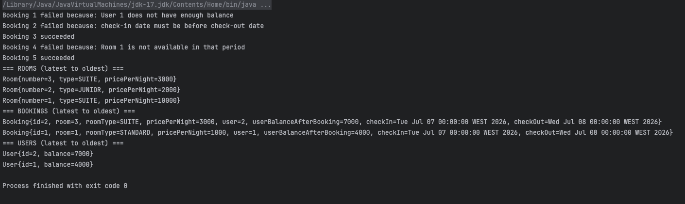

# Hotel Reservation System (Skypay Test)

Small in-memory hotel reservation system implemented in Java (Maven) for the Skypay technical test.

## Features

- Manage **rooms**, **users**, and **bookings** using `ArrayList` only.
- `setRoom(int roomNumber, RoomType type, int pricePerNight)`
    - Creates or updates a room.
- `setUser(int userId, int balance)`
    - Creates or updates a user.
- `bookRoom(int userId, int roomNumber, Date checkIn, Date checkOut)`
    - Checks date validity, room availability (no overlap), and user balance.
    - Debits the user if booking succeeds.
- `printAll()`
    - Prints rooms and bookings from latest to oldest.
- `printAllUsers()`
    - Prints users from latest to oldest.
- Each `Booking` stores a **snapshot** of room type/price and user balance at booking time, so later `setRoom` calls do **not** affect past bookings.
- Dates in bookings are printed as `dd-MM-yyyy` (day-month-year).

Money is represented with `int` as required in the test description.

## Entry Point

Main class:

- Package: `org.skypay.hotelreservationsystem`
- File: `src/main/java/org/skypay/hotelreservationsystem/Main.java`

`Main` sets up example rooms/users, performs several bookings, then calls `printAll()` and `printAllUsers()`.

## How to Run

From the project root:

```bash
./mvnw clean compile
./mvnw exec:java -Dexec.mainClass="org.skypay.hotelreservationsystem.Main"
```
### Screenshot of the result output of the testcases



### Answer to the bonus Question 1

Suppose we put all the functions inside the same Service. Is this recommended?

For this small test project it’s acceptable and keeps the code simple.

For a real application no it’s not recommended.

One Service mixes room management, user management, booking rules, and printing.

That makes the code harder to maintain, test, and evolve.

In a real system, it would be better to split the services each with a single responsibility.